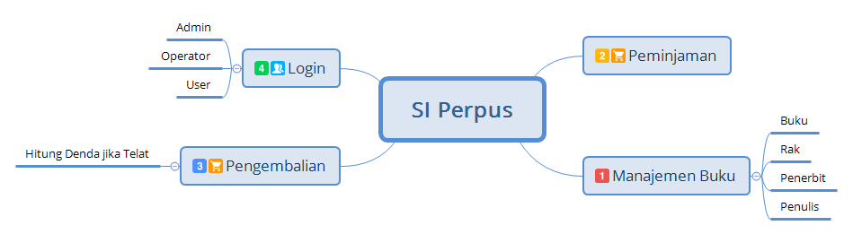

# Aplikasi Perpustakaan

Sistem Aplikasi perpustakaan meliputi:

* Management Buku
    * Master Buku
    * Master Rak
    * Master Penerbit
    * Master Penulis
* Transaksi Peminjaman Buku
* Transaksi Pengembalian Buku
* Login
    * Admin
    * Operator
    
Teknologi yang digunakan diantaranya:

* MySQL sebagai database management system
* Java EE sebagai bahasa pemograman
* Spring Framework 
    - Spring Web MVC sebagai aplikasi front-end
    - Spring Data JPA (Java Persistence API) implementasi Hibernate ORM
    - Thymeleaf Template Engine untuk merender halaman web (HTML)
* Hibernate